# 何月 · Howmoon · Earth Dialogue

<p align="center">
  和地球聊聊，找到此刻真正想去的地方。
</p>

<p align="center">
  <a href="https://howmoon-earth-dialogue.vercel.app">在线体验</a>
</p>

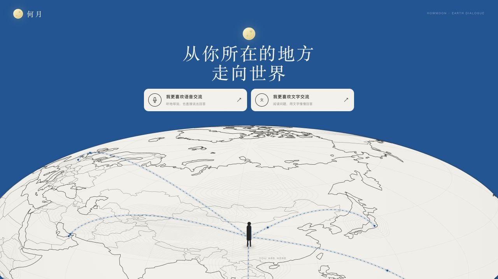

何月从一个很轻的问题开始。你可以打字，也可以直接开口，说出一段一直记得的旅途、最近的精神状态，或者此刻最想逃离什么。地球会沿着这些回答继续追问，慢慢把一个模糊的念头变成一座可以进入的城市。

目的地亮起以后，地图不会停在一个地名上。现在有 17 座城市可以走进去，110 处景点可以细看。你可以沿着杭州的水岸散步，抬头看纽约的退台高楼，也可以在佛罗伦萨的红瓦穹顶下停一会儿。屋顶、台基、穹顶、回廊与海岸线，都成为可以阅读的城市切片。

## 把你喜欢的城市，也带进来

欢迎提 PR，把你去过的城市、舍不得忘记的景点加进何月。可以是一座熟悉的古城，也可以是你常去散步的海岸。选出值得停下来的地方，配上认真查过的讲解，让下一个点亮这座城市的人也能多看懂一点。

补一处建筑细节、纠正一个地名，或修好手机上的交互，也都欢迎。还不熟悉代码的话，可以先 [开一个 Issue](https://github.com/usersx/howmoon-earth-dialogue/issues/new)，告诉我们城市、景点和你的想法。

准备动手时，先读 [贡献指南与 PR 标准](CONTRIBUTING.md)。新增城市按现有的城市名片、六景长卷和景点图鉴来做，提交时附资料来源、素材使用依据、实际截图及测试结果。未做完的内容可以先开 Draft PR，不必假装已经完成。

开发者和 AI 接手前请读 [AGENTS.md](AGENTS.md)，其中记录了代码入口、构建步骤、历史问题和不能忽略的边界。

## 一次完整的旅行对话

### 先选择你习惯的交流方式

蓝色首页保留了完整的素描线稿地球。国家边界、经纬网、城市点与旅行航线会随地球缓慢自转，也支持鼠标拖拽和滚轮缩放。

### 让问题慢一点

文字模式使用暖白纸张质感。每次回答后会出现明确的思考等待，接入千问或 DeepSeek 后由真实模型继续对话；没有配置 Key 时也能用本地模式体验完整流程。

| 文字深谈 | AI 继续追问 |
| --- | --- |
| 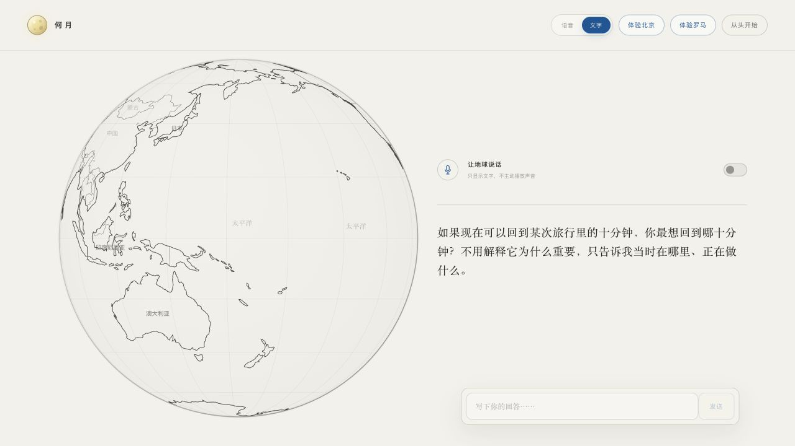 | 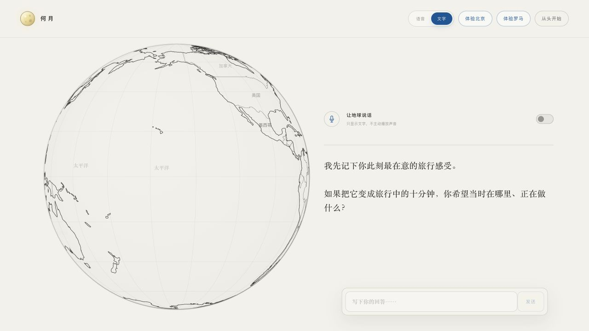 |

### 看着目的地在地球上亮起

当信息足够时，推荐城市会落到地球的真实坐标附近。持续呼吸的光点把对话结果和下一段视觉体验连在一起。

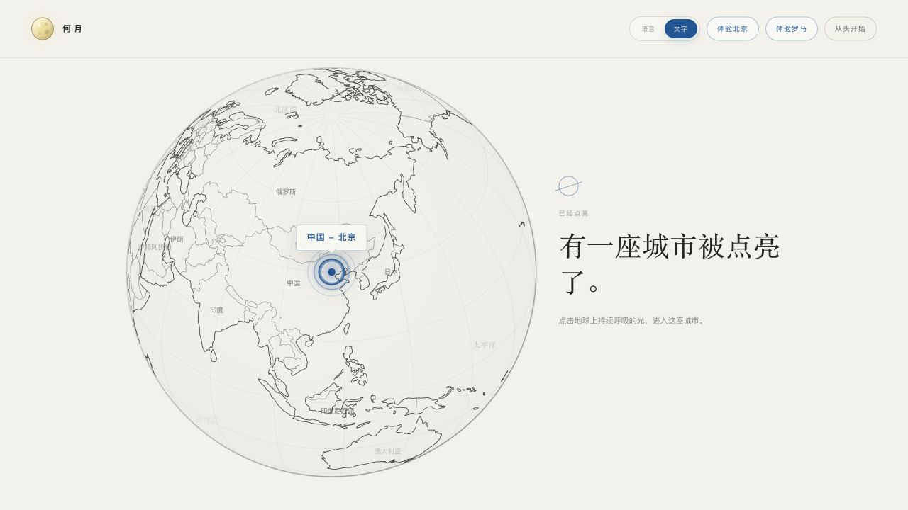

### 从城市天际线走进建筑长卷

北京从皇城屋脊延伸到现代天际线，罗马沿石路进入两千年的城市层次。新的旅程还包括东京、西安、杭州、南京、哈尔滨、三亚、广州、深圳、新加坡、厦门、佛罗伦萨、巴黎、伦敦、纽约与柏林，每座城市都有自己的全屏名片与景点长卷。

[打开城市图鉴](https://howmoon-earth-dialogue.vercel.app/cities/)，可以按中文名、英文名或国家寻找下一站，也可以先在地球上将它点亮。

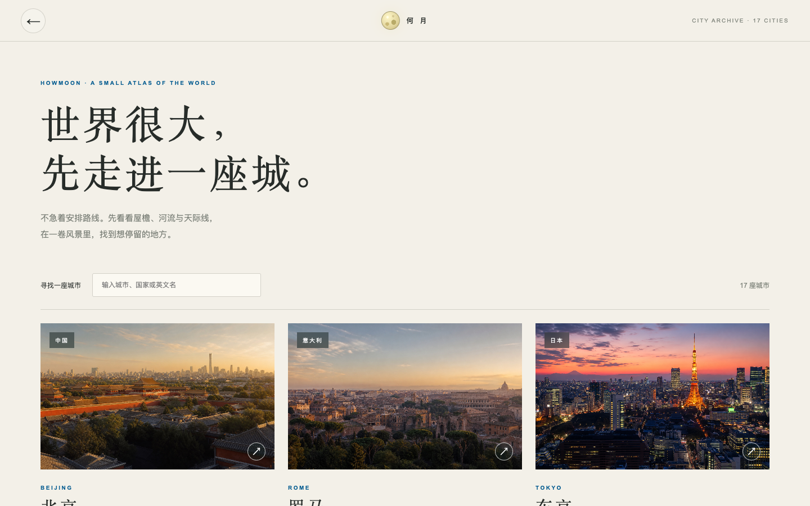

| 珠江入夜的广州 | 花园环抱的新加坡 |
| --- | --- |
| 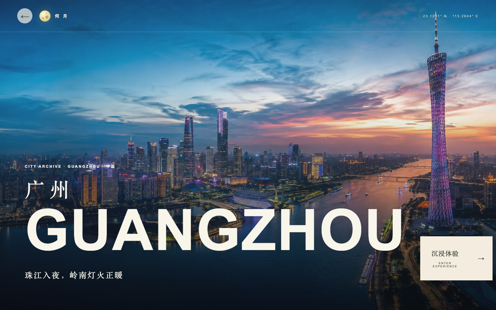 | 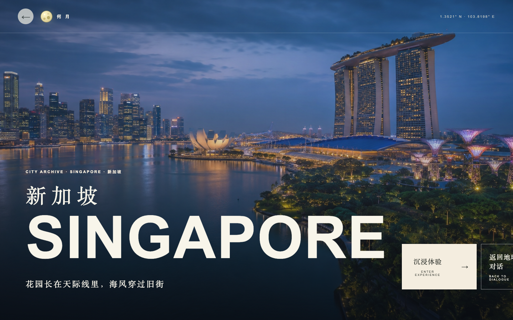 |

| 西湖晨光里的杭州 | 阿诺河畔的佛罗伦萨 |
| --- | --- |
| 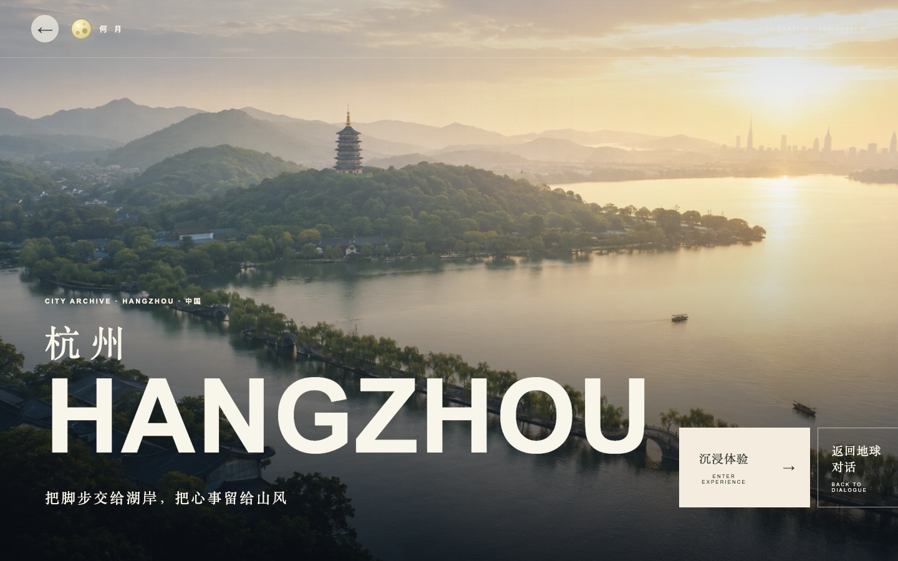 |  |

| 泰晤士河畔的伦敦 | 曼哈顿的纽约 |
| --- | --- |
| 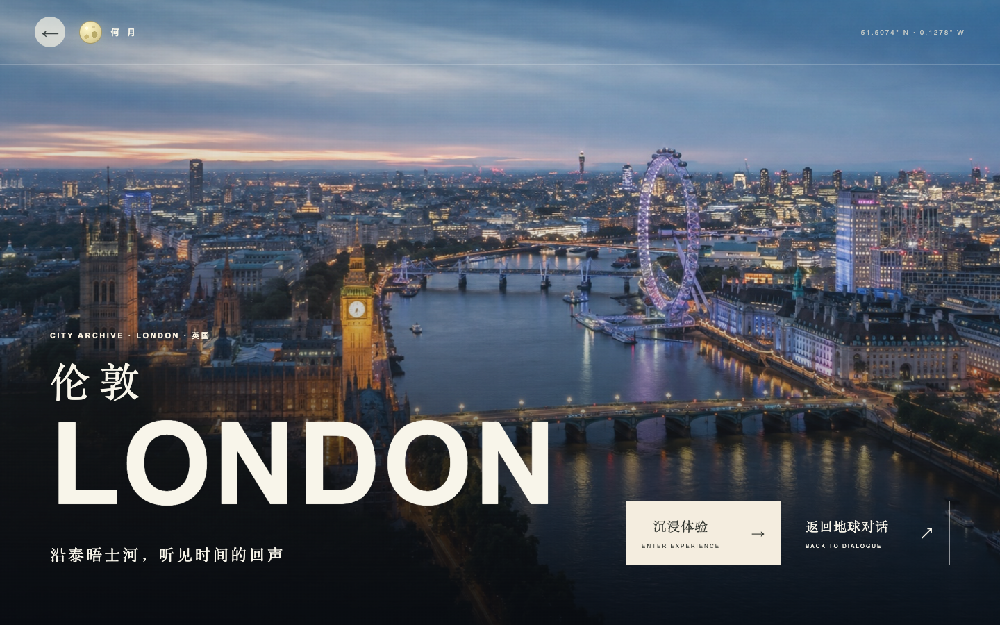 | 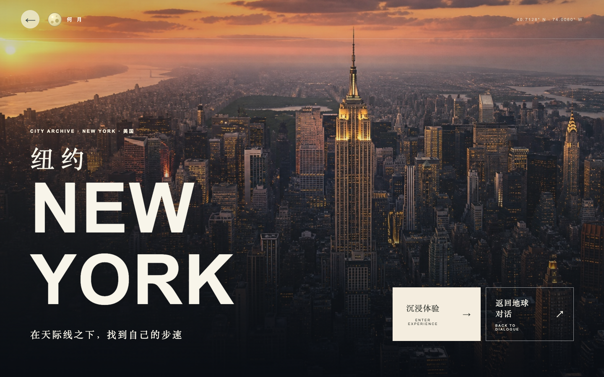 |

| 北京 | 罗马 |
| --- | --- |
| 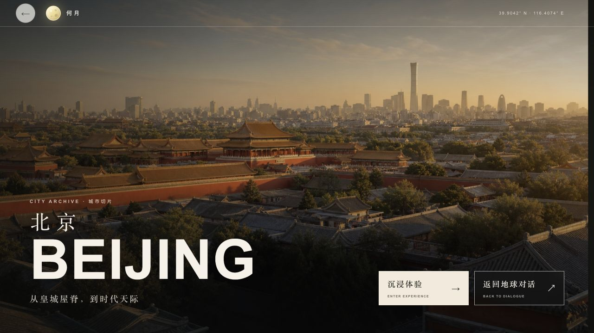 | 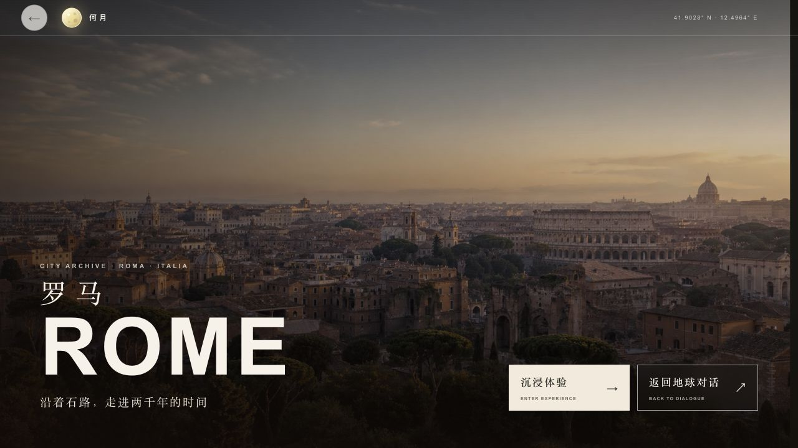 |

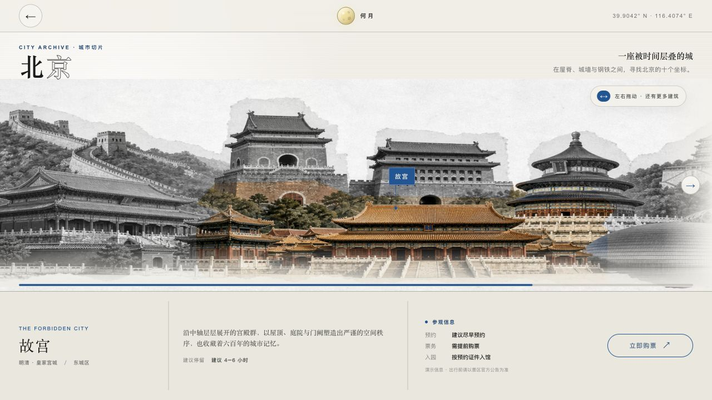

### 把一座建筑读得更近

进入图鉴后，放大镜默认跟随鼠标，移动就能读到细节。光点对应具体的建筑部位，点击可以打开局部说明；继续向下，景点背景、空间观察与漫游建议会展开成完整的讲解。手机上可点按光点阅读，新图鉴也会自动调整排版。

北京、罗马原有的 20 个图鉴同样补上了下方阅读区。下面是故宫太和殿，光点分别对应屋顶、开间、台基、彩画与典礼空间。

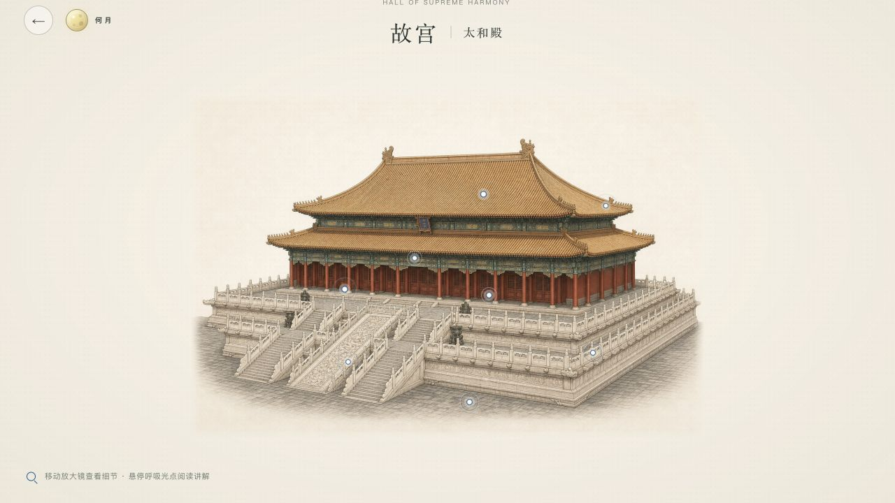

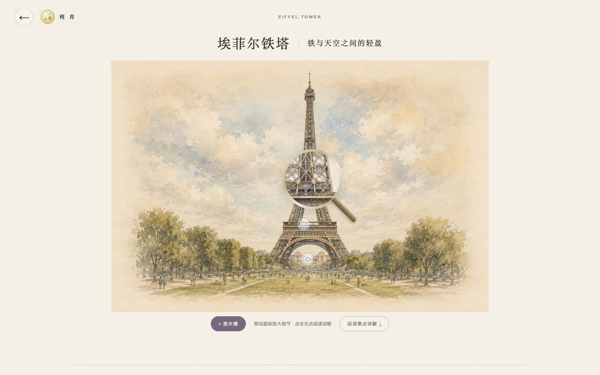

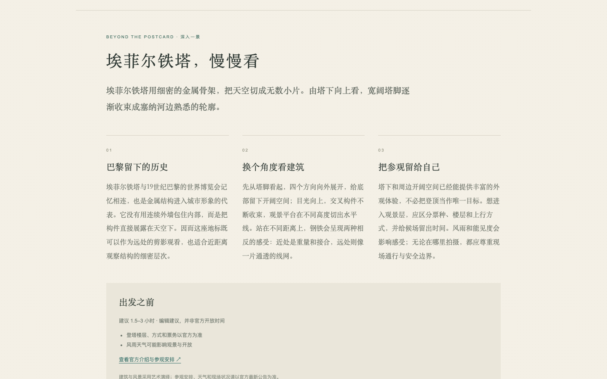

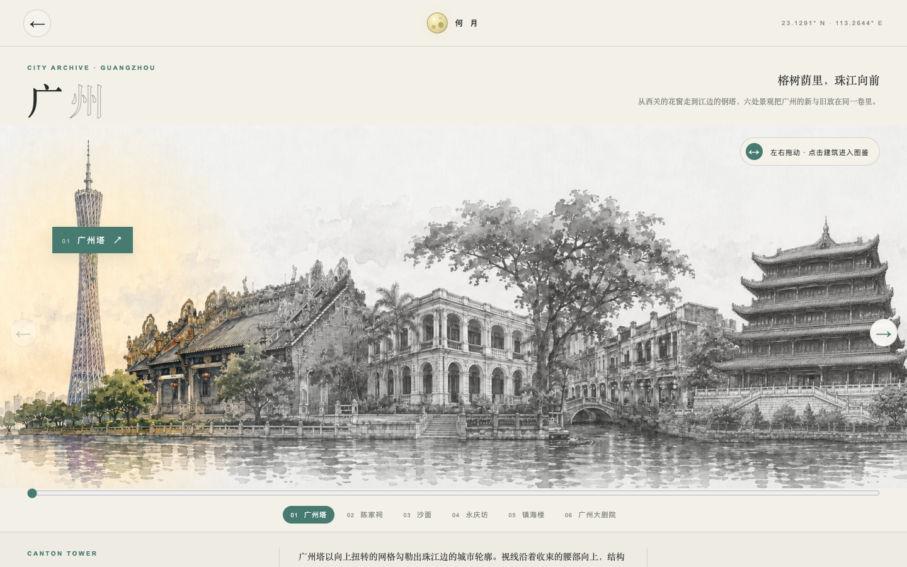

## 现在可以体验的内容

| 能力 | 具体表现 |
| --- | --- |
| 地球交互 | 慢速自转、鼠标拖拽、滚轮缩放、国家边界、经纬网、城市点与航线 |
| 深度对话 | 文字输入、语音录制、连续追问、对话恢复、重新开始与结果缓存 |
| AI 接入 | 千问优先、DeepSeek 自动故障切换，SSE 流式协议，保留可感知的思考时间 |
| 语音能力 | macOS 本地朗读、Windows/Linux/Vercel 千问在线朗读、千问 `qwen3-asr-flash` 语音转写 |
| 目的地呈现 | 城市坐标定位、地球光点锁定、个性化城市插画与标准 PNG 下载 |
| 旅行小画 | 千问根据城市、活动和情绪绘制暖白留白水彩，支持“再画一张” |
| 机票衔接 | 点击“当前机票信息”打开 Trip.com，并自动填入推荐城市对应的机场 |
| 城市体验 | 17 座城市名片与长卷、110 个景点图鉴、默认跟随放大镜、热点说明与分节讲解 |
| 本地运行 | 一个 FastAPI 进程同时提供网页和接口，双击脚本即可启动 |

## 快速开始

城市内容与构建说明见 [城市图鉴开发说明](docs/city-atlases.md)。封面和插画为艺术演绎，长卷按主题排布，不是实拍、实时街景或精确地图。

第一次使用时双击

```text
setup-local.command
```

安装完成后双击

```text
start-local.command
```

浏览器访问

```text
http://localhost:3000
```

命令行方式也很简单

```bash
python3 -m venv backend/.venv
backend/.venv/bin/pip install -r backend/requirements-dev.txt
cp backend/.env.example backend/.env.local
./start-local.command
```

## 接入真实 AI

编辑 `backend/.env.local`，填入千问或 DeepSeek 的 Key。Key 只保存在这个本地文件里，`.gitignore` 会阻止它进入提交记录。

千问同时承担对话与中文语音转写，只需要一个 Key。

```text
DASHSCOPE_API_KEY=
QWEN_MODEL=qwen3.7-plus
QWEN_ASR_MODEL=qwen3-asr-flash
QWEN_TTS_MODEL=qwen3-tts-flash
QWEN_TTS_VOICE=Cherry
```

使用 DeepSeek 对话时填写

```text
DEEPSEEK_API_KEY=
DEEPSEEK_MODEL=deepseek-v4-flash
```

没有配置 Key 时，项目会进入本地确定性对话模式，并保留约 2.6 秒的思考状态。若希望启动时强制检查真实模型配置，可以设置

```text
ALLOW_MOCK_DIALOGUE=false
```

## 接口与运行方式

前端使用五组接口完成对话、定位、语音与图片生成。

| 接口 | 用途 |
| --- | --- |
| `POST /api/dialogue` | 多轮旅行对话与最终目的地结果 |
| `POST /api/geography` | 城市坐标与地点信息 |
| `POST /api/tts` | 16 或 24 kHz 单声道语音输出 |
| `POST /api/transcribe` | 浏览器录音转写 |
| `POST /api/city-visual` | 生成可下载的 1024 × 1024 PNG 城市插画 |

更完整的请求与响应字段见 [API_CONTRACTS.md](API_CONTRACTS.md)。

## 项目结构

```text
.
├── site/                  浏览器直接运行的页面、脚本和城市数据
├── public/assets/         Git 管理的图片，本地和 Vercel 使用同一份源文件
├── backend/               FastAPI 服务、AI 接入与图片生成
├── backend/tests/         接口与回归测试
├── docs/screenshots/      README 使用的真实运行截图
├── scripts/               资源维护脚本
├── setup-local.command    首次安装入口
└── start-local.command    日常启动入口
```

## 验证

```bash
cd backend
.venv/bin/pytest -q
```

测试覆盖健康检查、对话 SSE、地理信息、TTS、转写、城市水彩生成和静态路由。现有城市图鉴覆盖 17 座城市、110 个景点；具体已测范围与未测边界见 [验证记录](docs/city-atlas-verification.md)。测试结果请以本次实际运行输出为准。

## 名字

何月读起来像一个人的名字，也像一句关于时间的提问。Howmoon 把月亮放进英文名里。它适合这段体验，因为旅行往往从一个很小的念头开始，然后才在地球上有了坐标。
